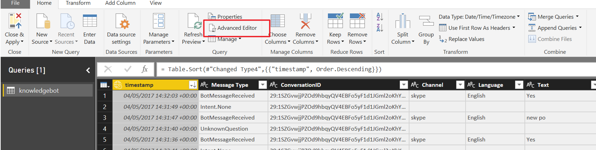

# Conversational Telemetry - PowerBI

Once you have Telemetry flowing you can view in the Application Insights Portal and also configure the sample PowerBI dashboard to point at your data. Note this is a sample enabling you to get started.

 - Download PowerBI Desktop from [here](https://powerbi.microsoft.com/en-us/desktop/)
 - Open the [provided]("/ConversationalTelemetry/PowerBI/ConversationalAIBotDashboard.pbix") PowerBI file
 - Go to Query Editor and click on Advanced Editor
 - Click Edit Queries
 
 
 - Then Advanced Editor
 
 - This will open the exported Application Analytics query which was originally created in Application Analytics
 - Find https://api.applicationinsights.io/v1/apps/e462b017-afdc-4beb-9e1c-c90ebaaa0dd6/query at the top of the query and replace the GUID with the Application ID of your Application Insights Application which you can find under the API Access section in the Azure Portal. You can use your Azure credentials so don't need to create a key
 
 - Update your credentials. If using an external subscription, make sure you log into it when prompted. Otherwise the data will not load.
